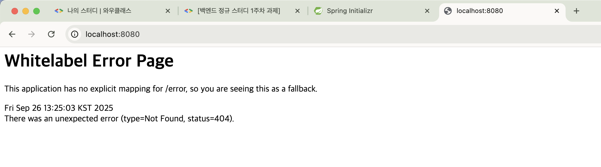

## <백엔드 스터디 1주차 WIL>

### 1. 이번주 스터디 목표
* 웹과 HTTP, REST API에 대해 알아보고 API를 작성해 본다.

### 2. 오늘의 키워드
* 웹과 HTTP, REST API

### 3. 정리

**1) 웹이란?** 

- 웹은 인터넷에서 제공되는 하나의 서비스이다.  
- **웹**은 **클라이언트와 서버**의 통신으로 동작한다.  
  - 웹사이트 화면을 구성하는 요소(텍스트, 이미지, 영상 등)를 오브젝트라고 한다.  
  - 클라이언트가 웹사이트에 접속하면 서버에 오브젝트를 요청하고, 서버는 이를 전달한다.  
  - 전달된 오브젝트들이 모여 웹페이지가 완성된다.  
  - 이때 클라이언트와 서버는 HTTP라는 표준 프로토콜을 사용해 통신한다.  

- **URL**은 웹 상에서 특정 자원의 위치를 나타내는 주소이다.  
  - 클라이언트는 URL의 도메인 이름을 DNS 서버에서 조회해 실제 서버(IP 주소)를 알아낸다.  
  - URL에 포함될 수 있는 포트 번호는 서버가 어떤 서비스를 제공할지 구분하는 번호이며,  
    Application Layer와 Transport Layer 사이를 연결하는 통로 역할을 한다. 

**2) HTTP**
- HTTP는 클라이언트와 서버가 통신하기 위해 Application Layer위에서 작동하는 표즌 프로토콜이다.
- HTTP는 무상태성과 비연결성이라는 특징을 가진다.
  - **무상태성 (Stateless)**  
    - 서버는 클라이언트의 이전 요청 정보를 저장하지 않고, 각 요청을 독립적으로 처리한다.  
    - 만약 모든 사용자의 상태를 저장하면 서버에 큰 부하가 발생하기 때문에 무상태성을 유지한다.  

  - **비연결성 (Connectionless)**  
    - 클라이언트가 요청을 보내고 응답을 받으면 서버와의 연결을 유지하지 않는다.  
    - 과거에는 요청마다 연결을 새로 맺고 종료했다.
    - 현대 웹은 과거와 연결은 같은 방식이나 한 번 연결 후 여러 응답을 주고받은 뒤 종료한다는 다른점이 있다. 

- HTTP 주요 메서드
  
  - **GET** : 리소스를 조회  
    - 예시: 웹 브라우저에서 게시글 목록 페이지를 불러오기  

  - **POST** : 리소스를 추가(등록)  
    - 예시: 회원가입 폼을 제출해 새로운 사용자 계정을 생성  

  - **PUT** : 리소스를 전체 교체 (없으면 새로 생성)  
    - 예시: 게시글 수정 시, 기존 게시글 내용을 통째로 새 내용으로 덮어쓰기  

  - **PATCH** : 리소스의 일부만 수정  
    - 예시: 사용자 프로필에서 이메일 주소만 수정  

  - **DELETE** : 리소스를 삭제  
    - 예시: 게시판에서 특정 게시글 삭제  

* ‼️ PUT과 PATCH의 차이점을 잘 기억해야 겠다.

**3) API와 REST API**

- **API**  
  - 프로그램끼리 서로 기능이나 데이터를 주고받을 수 있도록 정해놓은 약속이다.
  - 쉽게 말해 "소통할 수 있는 언어" 같은 것이다.  

- **REST API**  
  - API 중에서도 **REST 원칙**(자원을 URI로 표현, HTTP 메서드 활용, 무상태성 등)을 따르는 방식이다.  
  - 같은 내용을 전달하더라도 일관된 문법과 규칙을 지켜야 소통이 가능하다.

### 4. 느낀점
- 백엔드가 아예 처음은 아니다.
- 그렇다고 기본이 탄탄하지 않기에 열심히 임해야 겠다.
- 언제 들어도 까먹고 있었던 내용은 항상 존재하는 것 같다.

### 5. 다음 스터디 목표
- 계층형 아키텍처와 컨트롤러, 서비스에 대해 이해해본다.

================================================
### 6. 과제

#### 1) 스프링 부트 실행 화면

#### 2) api 작성

| 회원기능           | Method | URL                 |
|------------------|--------|---------------------|
| 회원 등록          | POST   | /members            |
| 회원 목록 조회      | GET    | /members            |
| 개별 회원 조회      | GET    | /members/{memberId} |
| 회원 정보 수정      | PATCH  | /members/{memberId} |
| 회원 삭제          | DELETE | /members/{memberId} |

| 상품기능              | Method | URL                   |
|---------------------|--------|-----------------------|
| 상품 정보 등록         | POST   | /products             |
| 상품 목록 조회         | GET    | /products             |
| 개별 상품 정보 상세 조회 | GET    | /products/{productId} |
| 상품 정보 수정         | PATCH  | /products/{productId} |
| 상품 삭제             | DELETE | /products/{productId} |

| 주문기능              | Method | URL               |
|---------------------|--------|-------------------|
| 주문 정보 생성         | POST   | /orders           |
| 주문 목록 조회         | GET    | /orders           |
| 개별 주문 정보 상세 조회 | GET    | /orders/{orderId} |
| 주문 취소             | DELETE | /orders/{orderId} |