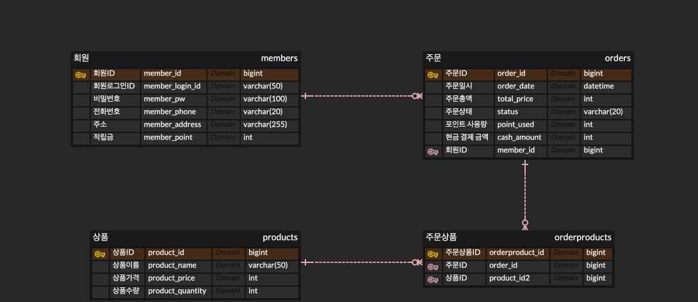
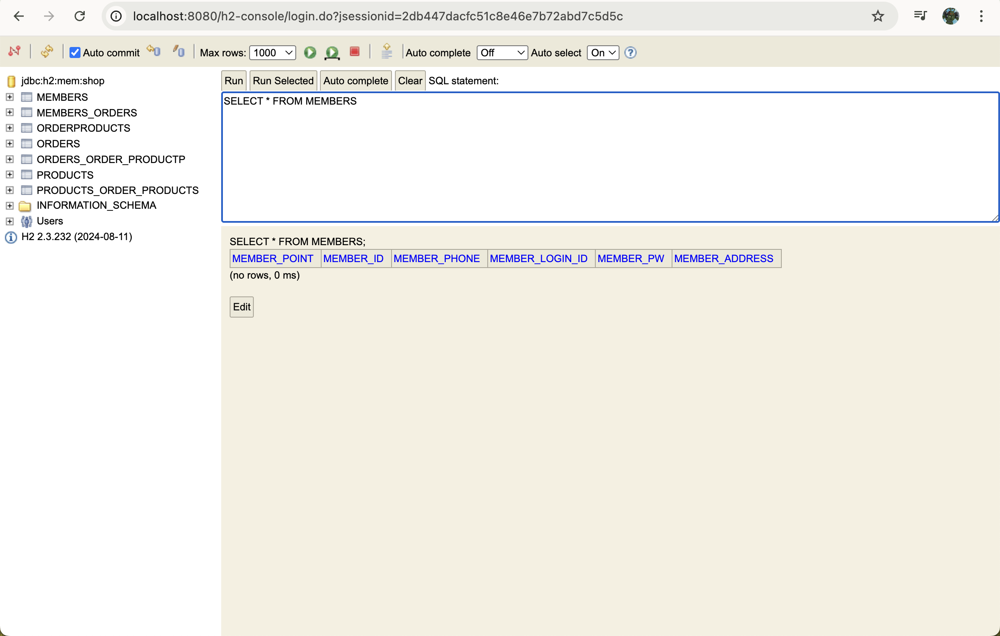
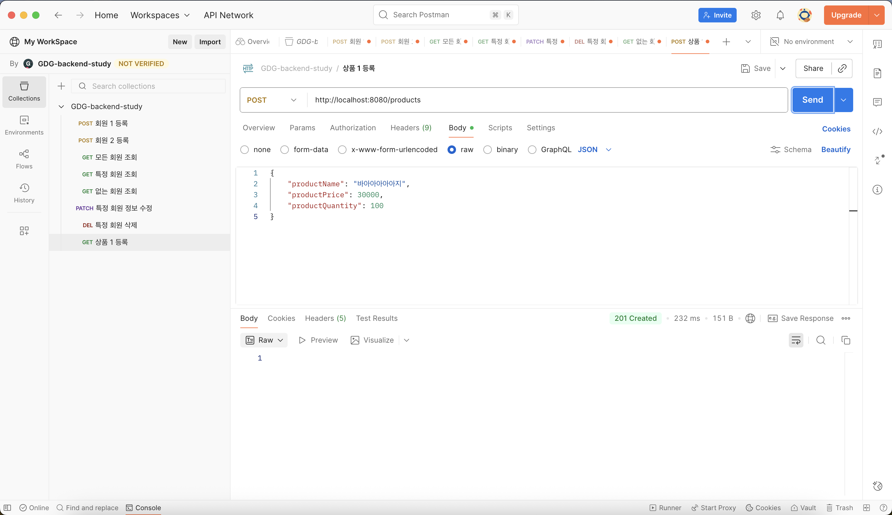
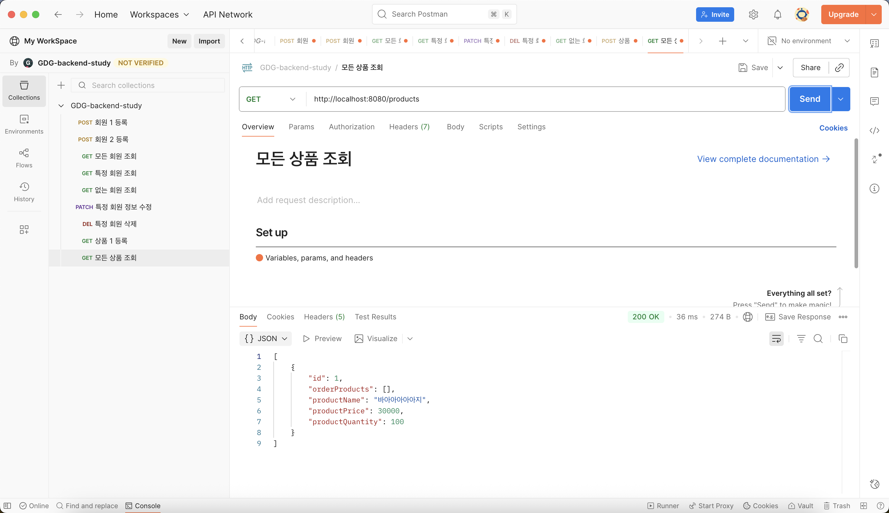
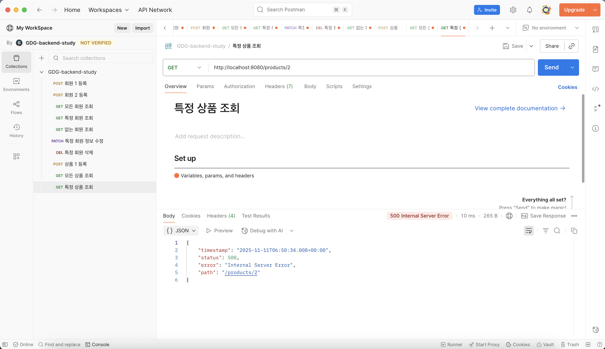

## <백엔드 스터디 4주차 WIL>

### 1. 이번주 스터디 목표
* ERD를 이해하고, 데이터베이스 설계 내용을 코드(Entity)로 구현해본다.

---

### 2. 오늘의 키워드
* ERD, DB, Entity, Relationship, JPA 매핑

---

### 3. 정리

1) 데이터베이스 모델링

- ERD (Entity Relationship Diagram)  
  데이터 간의 관계를 시각적으로 표현한 다이어그램.  
  테이블(엔티티), 속성(컬럼), 관계(연결선)으로 구성된다.

- 엔티티(Entity)  
  관리해야 할 데이터의 주체로, 데이터베이스의 테이블에 해당한다.  
  자바에서는 클래스 형태로 표현되며, JPA가 엔티티 클래스를 기반으로 테이블을 자동 생성한다.

- 속성(Attribute)  
  엔티티가 가지는 구체적인 정보로, 테이블의 컬럼에 해당한다.

- 기본 키(Primary Key, PK)  
  테이블 내에서 각 데이터를 고유하게 식별하기 위한 컬럼.  
  예: 회원 번호, 주문 번호 등.

- 외래 키(Foreign Key, FK)  
  다른 테이블의 PK를 참조하는 속성으로, 두 테이블 간의 관계를 연결하는 데 사용된다.

- 관계(Relationship)  
  엔티티 간의 연관성.  
  - 1:N (일대다) : 한 회원은 여러 주문을 가질 수 있다.  
  - N:1 (다대일) : 여러 주문은 한 회원에 속한다.  
  - 1:1 (일대일) : 하나의 회원은 하나의 프로필만 가진다.  
  - N:N (다대다) : 여러 회원이 여러 상품을 가질 수 있지만, 중간 엔티티를 두어 해결한다.  

- 식별 관계 vs 비식별 관계  
  식별 관계는 참조한 테이블의 PK를 자신의 PK로도 사용하는 관계이며,  
  비식별 관계는 참조한 테이블의 PK를 단순 FK로만 사용하는 관계다.

---

2) 설계도를 코드로 (JPA 매핑)

- @JoinColumn  
  외래 키(FK) 칼럼을 지정하며, 관계의 연결 기준 컬럼을 명시한다.  

- @ManyToOne  
  다대일(N:1) 관계를 표현할 때 사용한다.  
  예: 여러 주문(Order)은 한 회원(Member)에 속한다.  
  fetch 속성  
    - EAGER : 즉시 로딩, 데이터를 조회할 때 연관된 엔티티까지 한 번에 불러온다.  
    - LAZY : 지연 로딩, 실제로 필요한 시점에 연관 엔티티를 불러온다. (실무 권장)

- @OneToMany / @OneToOne / @ManyToMany  
  엔티티 간 관계를 정의할 때 사용한다.  
  mappedBy 속성으로 주인과 비주인을 구분하며, @ManyToMany는 중간 테이블을 직접 엔티티로 분리하는 것이 일반적이다.

- @NoArgsConstructor  
  Lombok 어노테이션으로, JPA가 엔티티 객체를 생성할 때 필요한 기본 생성자(인자 없는 생성자)를 자동 생성한다.  

---

### 4. 느낀점 
- 이번 주차에서는 ERD를 실제 코드로 옮기며 데이터 구조와 객체 구조의 연결을 명확히 이해할 수 있었다.  
- 단순히 엔티티를 작성하는 것을 넘어 각 관계의 의미와 방향(1:N, N:1, 1:1)을 명확히 설계하는 것이 중요하다는 점을 느꼈다.  
- 데이터베이스 설계는 코드보다 먼저, 전체 시스템 구조를 결정짓는 핵심 단계임을 깨달았다.

---

### 5. 다음 스터디 목표
- 실제 데이터베이스를 연결(MySQL, H2)하여 JPA 동작을 확인한다.  
- CRUD 로직을 구현하고 트랜잭션, 페치 전략에 대한 실습을 진행한다.

---

### 6. 과제 스크린샷

- ERD
  

- H2 TABLE
  

- 상품등록
  

- 전체 상품 조회
   

- 특정 상품 조회 실패
  